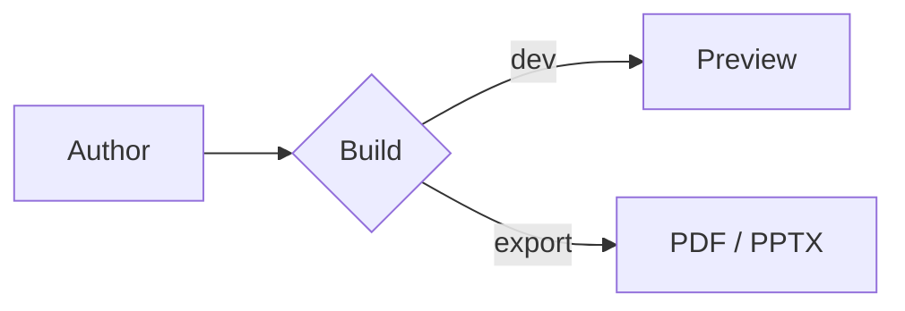
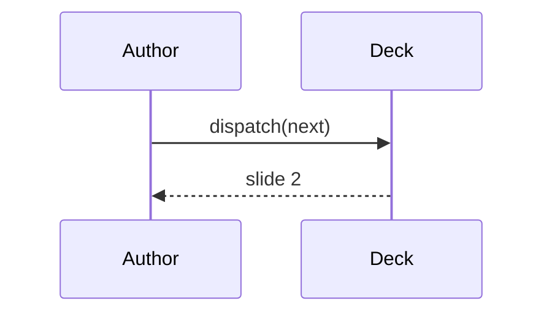

astro-slides renders math and diagrams from plain fenced/inline markup. **Math and PlantUML
render at build time** (they reduce to HTML or an `` — zero runtime bytes); **Mermaid is
the one lazily-hydrated diagram**, loaded only when a slide actually contains one.

## Math (KaTeX)

Math is rendered with [KaTeX](https://katex.org) at build time. Use `$…$` for inline math and
`$$…$$` for a centered display block.

````md
Euler's identity is $e^{i\pi} + 1 = 0$, inline in a sentence.

$$
\int_0^\infty e^{-x^2}\,dx = \frac{\sqrt{\pi}}{2}
$$
````

:::note
The `$…$` / `$$…$$` delimiters are tokenized by **`remark-math`** at parse time, which is
mandatory under MDX: without it, LaTeX braces like `e^{i\pi}` are read as JavaScript
expressions and the slide fails to parse *before* any rendering runs. This is why the
delimiters are the supported syntax — a `\( \)` / `\[ \]` style is not.
:::

If a single expression is malformed, KaTeX renders that one node in red (`throwOnError:
false`) rather than failing the whole build.

### Stepped math

A display block can reveal one equation row per click. Put a click-step spec in `{…}`
immediately after the opening `$$`, and split rows with `\\`. Each `\\`-separated row maps to
a step (`all` reveals the remaining rows), driven by the deck [click model](/interactivity/click-model/)
and numbered after prose and code clicks.

````md
$$ {1|2|all}
a^2 + b^2 = c^2 \\
E = mc^2 \\
\nabla \cdot \mathbf{E} = \frac{\rho}{\varepsilon_0}
$$
````

Here row 1 shows on step 1, row 2 on step 2, and the last row on the final step.

:::note
In stepped mode each `\\` row is rendered independently, so `&` column alignment across rows
isn't preserved — rows are left-aligned. Non-stepped `$$…$$` blocks align normally.
:::

### Conditional CSS

KaTeX's stylesheet is only linked into a deck when that deck actually uses math (the
`katex` feature flag, detected by the parser). Math-free decks ship no KaTeX CSS.

## Mermaid diagrams

Write a [Mermaid](https://mermaid.js.org) diagram in a `mermaid` fenced block. It renders on
the client, into an SVG mounted in a **Shadow DOM** (so Mermaid's injected CSS can't leak into
your deck, or vice versa). The Mermaid library is heavy, so it's **imported lazily and only
when a slide contains a diagram** — Vite code-splits it into its own chunk fetched on demand.

````md

````

By default the diagram theme follows the active color scheme (light/dark) and re-renders when
the scheme changes. You can override per-diagram via **fence options** after the language tag
(comma-separated `key: value` pairs):

````md

````

- `theme` — a Mermaid theme name (`default`, `dark`, `neutral`, `forest`, …). Overrides the
  automatic scheme-following.
- `scale` — a CSS transform scale factor applied to the rendered SVG.

## PlantUML diagrams

A `plantuml` (or `puml`) fenced block is **encoded at build time** into a URL on a PlantUML
server and rendered as a plain `` — no client JavaScript. Bare source is wrapped in
`@startuml`/`@enduml` automatically.

````md
```plantuml
Alice -> Bob: Authentication Request
Bob --> Alice: Authentication Response
```
````

The server defaults to the public `plantuml.com` renderer; point it at your own instance with
the `plantumlServer` integration option.

:::note
The PlantUML image is whatever the configured server renders — there's no automatic dark
variant, unlike Mermaid's scheme-following.
:::

## Source

- `packages/core/src/math/katex.ts` — `renderMath` via `katex.renderToString`.
- `packages/core/src/math/remark-katex.ts` — `inlineMath` / `math` → `<KaTeX>`, stepped rows.
- `packages/core/src/diagrams/remark-diagrams.ts` — mermaid/plantuml fences → components.
- `packages/core/src/diagrams/plantuml.ts` — build-time encoding + server URL.
- `packages/client/src/diagrams/mermaid.ts` — lazy load, Shadow DOM, scheme sync, option parsing.
- `packages/client/components/KaTeX.astro` — inline vs block KaTeX wrapper.
- `packages/client/components/Mermaid.astro` — the lazily-hydrated diagram island.
- `packages/client/components/PlantUml.astro` — the build-time-encoded ``.
- `packages/core/src/routes/slide.astro` — conditional KaTeX `<link>` via the `katex` feature.
- `docs/built/09-math-and-diagrams.md` — phase write-up.
