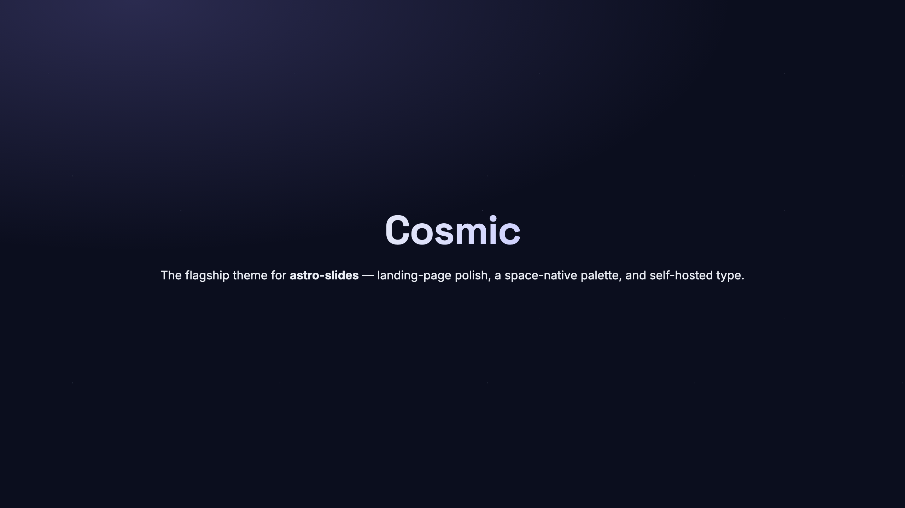
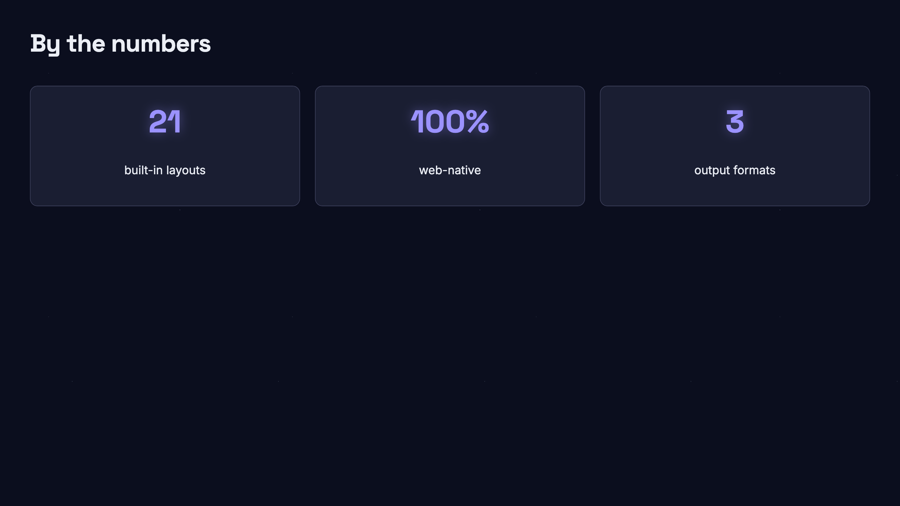
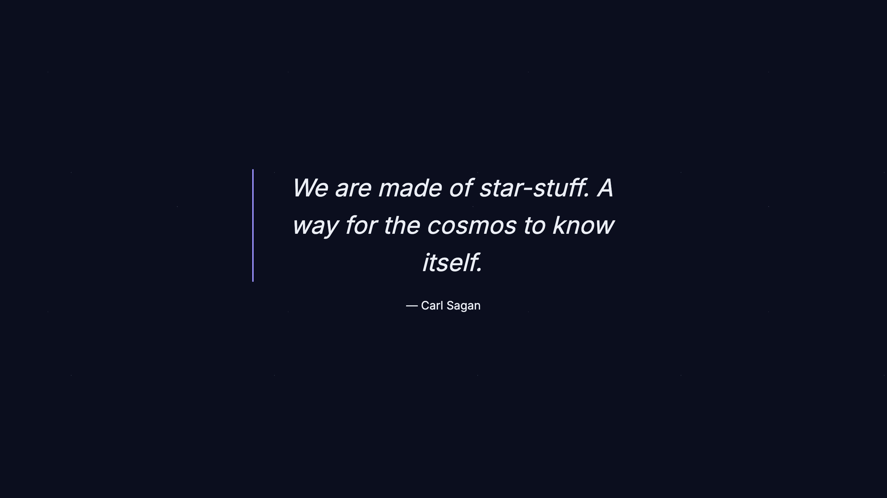
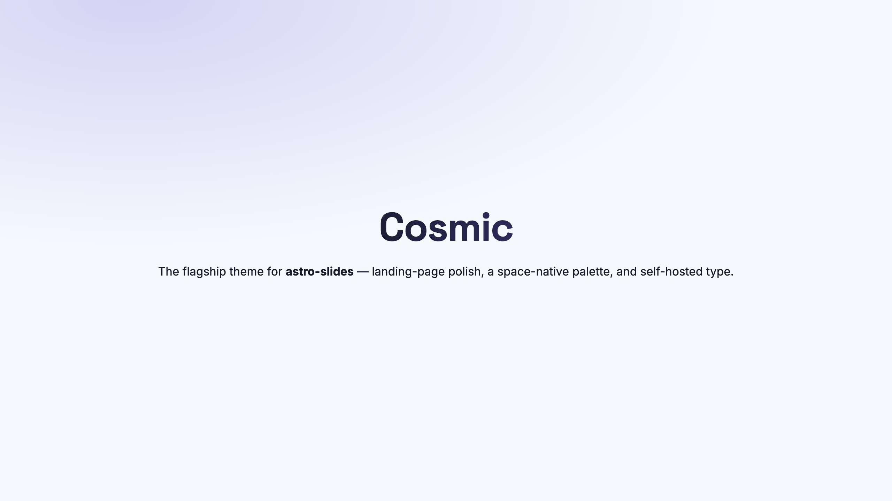
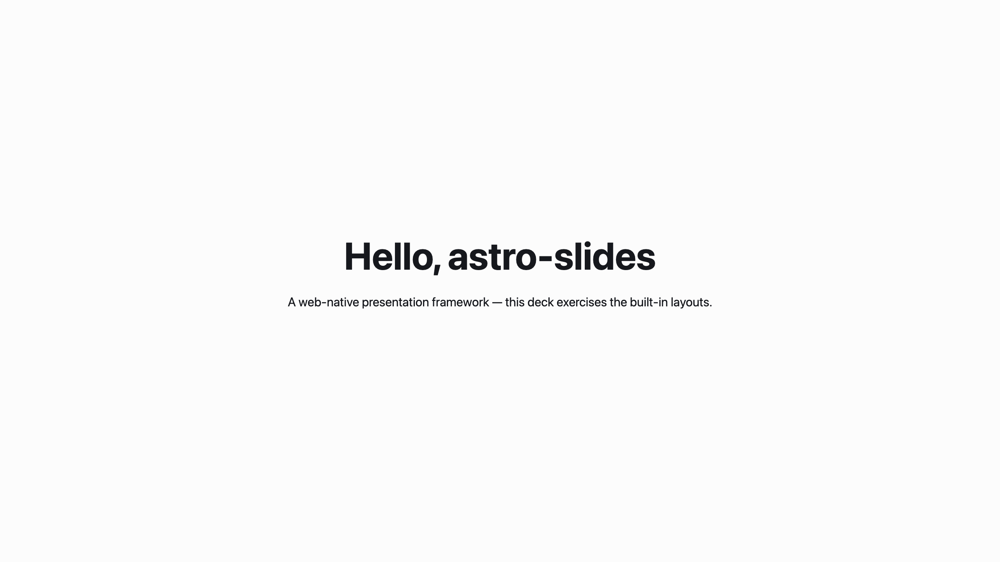

# Phase 16 — Cosmic, the flagship theme

Cosmic is astro-slides's default-quality theme: a deck authored in five minutes with no design
work looks good enough to ship. Dark is the primary mode (deep-space indigo), with a light
variant tuned for projectors. The space-theme nod — the project's namesake — shows up as a
subtle starfield and an oklch violet/cyan accent, never as garish chrome. Archived task notes:
`todo/archive/16-default-theme/`.

## What shipped

**Theme-by-name switching** — `packages/core/src/routes/{slide,print}.astro`
- The deck route stamps `data-theme={config.theme ?? "starter"}` on `.as-deck` (and print on
  `.as-print`). `config.theme` is the deck's `theme:` headmatter (`HeadmatterSchema.theme`
  defaults to `"starter"`).
- Every bundled theme CSS is imported by both routes. **starter** sets tokens on `:root` (the
  global default); the others scope their `--slide-*` tokens under a bare `[data-theme="<name>"]`
  selector. Because custom properties resolve by nearest ancestor, an opted-in deck's subtree
  overrides the `:root` defaults while every other deck keeps starter. The selector is bare
  (not `.as-deck[data-theme=…]`) so it matches on both the slide route (`.as-deck`) and the
  print route (`.as-print`).
- This also closes the Phase 15 gap: the Marp theme ports (`marp-default/gaia/uncover`) are now
  re-scoped from `:root` to `[data-theme="marp-<name>"]` and are selectable by name.

**Cosmic theme** — `packages/client/src/themes/cosmic/theme.css`
- **Palette (oklch).** Dark-primary semantic tokens — bg/fg/accent/accent-2/muted/border/
  surface/link/code/danger/info, plus the block family. A full light variant under both
  `@media (prefers-color-scheme: light)` (OS-light, unless a deck forces dark) and the forced
  `html[data-color-scheme="light"]` selector. No PostCSS hex fallback: oklch is universal in
  2026 and the starter theme already relies on it.
- **Typography.** Space Grotesk for display/headings (geometric), Inter for body — both
  self-hosted OFL via Fontsource, `@import`ed *from the theme CSS itself* so the client package
  (which declares the Fontsource deps) owns resolution. The `@font-face` blocks are cheap; woff2
  payloads only download when a rendered deck uses the families. A modular type scale
  (base 25px × 1.28) drives `--slide-text-sm…-4xl`.
- **8px vertical rhythm.** `--slide-space-unit: 8px` with `--slide-space-1…12` multiples, matching
  the token contract in `docs/architecture/theme-tokens.md`.
- **Visual pass.** Gradient-clipped `h1`; a soft accent aura on cover/section/intro; a leading
  accent bar on quotes; glowing accent numerals on `fact` and `.variant-metrics`; raised,
  hairline FlexBlock cards (features/metrics/steps); inset code panels.
- **Starfield.** A four-layer faint radial-dot pattern on `.as-viewport::before` (dark mode only;
  zeroed out in light). Pure CSS — no asset, scales with the design canvas. Planet glyphs were
  descoped in favour of keeping it tasteful.

**Showcase deck** — `examples/minimal/content/decks/cosmic/slides.mdx`
- Exercises cover, section, default, two-cols, features + metrics FlexBlocks, fact, statement,
  quote, and end with `theme: cosmic`. Doubles as the e2e fixture and the screenshot source.

## Comparison shots

Cosmic (dark, the flagship look):

Cosmic light variant vs. the Phase 05 starter theme (the meaningful in-repo before/after —
opting a deck into `theme: cosmic` vs. the default):

Shots are captured by driving `astro preview` with Playwright (dark shots emulate
`prefers-color-scheme: dark`). External comparisons against WebSlides / Slidev `default` +
`seriph` were descoped: those apps aren't buildable in-repo (reference-applications are
gitignored), and the starter-vs-cosmic pair is the comparison that actually informs the design.

## How to navigate the result

- `packages/client/src/themes/cosmic/theme.css` — the whole theme (tokens + visual pass + fonts).
- `packages/core/src/routes/{slide,print}.astro` — `data-theme` stamping + theme imports.
- `packages/client/src/themes/marp-*/theme.css` — re-scoped under `[data-theme]`.
- `examples/minimal/content/decks/cosmic/slides.mdx` — the showcase corpus.
- `e2e/theme.spec.ts` — asserts the cosmic deck stamps `data-theme`, resolves cosmic-hue accent
  tokens, keeps starter on `:root` for the default deck, and applies Space Grotesk to headings.

## Decisions & deviations

- **Location.** The locked plan said `themes/cosmic/` at the repo root, shipped via the CLI's
  `package.json::files`. Cosmic instead lives at `packages/client/src/themes/cosmic/`, alongside
  starter and the Marp ports — following the precedent set in Phase 05/15, where all bundled
  themes are CSS files consumed by the deck route. The `themes/*` workspace glob stays for
  *external/clone-target* themes; bundled defaults live with the client. Single, consistent
  loading path; no CLI packaging step needed.
- **Fonts @import'd from the theme, not the route.** The Fontsource deps are declared by
  `@astro-slides/client`; importing them from `@astro-slides/core`'s `.astro` routes failed
  pnpm resolution. Moving the `@import` into `cosmic/theme.css` keeps font ownership with the
  theme and the route font-agnostic.
- **Descoped:** PostCSS hex fallback (oklch is universal); planet-glyph accents (starfield only);
  per-layout `.astro` overrides (the token + selector pass in one CSS file covers every layout).
- **Gotcha:** MDX parses a line beginning with `export` as an ESM export — the metrics deck's
  "export formats" cell had to be reworded to "output formats".
