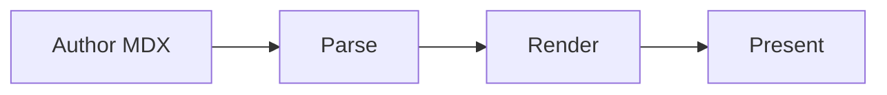

# Hello, astro-slides

A web-native presentation framework — this deck exercises the built-in layouts.

<!--
Welcome the audience. [click] Mention the web-native angle. [click:2] Then move on.
-->

---
layout: section
---

## Layouts

---

## Default layout

- Markdown lists
- **Bold** and _italic_
- `inline code`
- [links](https://example.com)

---
layout: center
---

## Centered

Content centered on both axes via the `center` layout.

---
layout: two-cols
---

Left column content.

- point A
- point B

::right::

Right column content.

- point C
- point D

---
layout: statement
---

Ideas worth presenting deserve the web.

---
layout: fact
---

**100%**

web-native

---
layout: quote
---

> The best way to predict the future is to invent it.

---

## Click steps

<Click>revealed on step one</Click>

<Click>revealed on step two</Click>

<Clicks>

<div>grouped reveal A</div>

<div>grouped reveal B</div>

</Clicks>

---
transition: slide-left
---

## Directional transition

This slide arrives with a `slide-left` transition (per-slide `transition:` frontmatter).

---

## Morph: before

<Morph id="hero" as="div" class="demo-hero">astro-slides</Morph>

---
layout: center
---

<Morph id="hero" as="div" class="demo-hero demo-hero--big">astro-slides</Morph>

The `<Morph>` element above continues from the previous slide — same-document View
Transition where supported, FLIP animation as the fallback.

---

## Syntax highlighting

```ts {2,4} title="fib.ts"
function fib(n: number): number {
  if (n < 2) return n;
  let [a, b] = [0, 1];
  for (let i = 2; i <= n; i++) [a, b] = [b, a + b];
  return b;
}
```

---

## Click-stepped lines

```ts {1|2|3}
const parse = compile(source);
const plan = resolve(parse);
render(plan);
```

---

## Snippet import

<<< @/snippets/greet.ts#greet {ts} {1}

---

## Magic Move

````md magic-move
```ts
const total = items.reduce((a, x) => a + x, 0)
```
```ts
const total = items.reduce((sum, item) => sum + item.price, 0)
```
```ts
const total = items
  .filter((item) => item.inStock)
  .reduce((sum, item) => sum + item.price, 0)
```
````

---

## Math

Euler's identity — $e^{i\pi} + 1 = 0$ — inline, and the Gaussian integral in a block:

$$
\int_{-\infty}^{\infty} e^{-x^2}\,dx = \sqrt{\pi}
$$

---

## Stepped derivation

$$ {1|2|3}
a^2 + b^2 = c^2 \\
c = \sqrt{a^2 + b^2} \\
c^2 - a^2 = b^2
$$

---

## Mermaid diagram



---

## PlantUML diagram

```plantuml
Alice -> Bob: Authentication Request
Bob --> Alice: Authentication Response
```

---

## Speaker notes demo

This slide has stepped notes — open the presenter view to see them highlight.

<Click>first reveal</Click>

<Click>second reveal</Click>

<!--
Reveal the **first** point [click], then the **second** [click], then wrap up.
Notes support _markdown_.
-->

---
layout: end

class: themed-accent
---

## Thanks

Questions?
