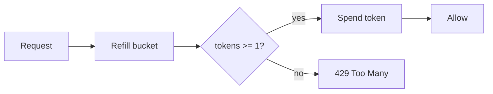

# Building a Rate Limiter in TypeScript

A hands-on walk through the **token bucket** algorithm — from a naive counter to a production-ready limiter.

<!--
Set the stakes: every public API needs a rate limiter. [click] We'll build one from scratch, refactoring as we go. Keep the pace brisk — the code does the talking.
-->

---
layout: section
---

## Why rate limit?

---
layout: two-cols
---

### The problem

- A burst of requests can exhaust your database connections.
- You want to allow **short bursts** but cap the **sustained rate**.
- The token bucket gives you both with one small piece of state.

Fill a bucket with tokens at a steady rate; each request spends one. An empty bucket means throttle.

::right::

```ts title="types.ts"
interface Bucket {
  tokens: number;
  capacity: number;
  lastRefill: number;
}

interface Limiter {
  take(key: string): boolean;
}
```

---

## A naive fixed-window counter

Start simple — count requests per window and reset on a timer.

```ts {1,3-5} title="naive.ts" lineNumbers
const counts = new Map<string, number>();

function allow(key: string, limit: number): boolean {
  const n = (counts.get(key) ?? 0) + 1;
  counts.set(key, n);
  return n <= limit;
}
```

Lines 3–5 are the whole decision — but resets create a spike at every window boundary.

---

## Refilling the bucket, step by step

```ts {1|2-3|4-6|all} title="refill.ts" lineNumbers
function refill(b: Bucket, rate: number, now: number): Bucket {
  const elapsed = (now - b.lastRefill) / 1000;
  const added = elapsed * rate;
  const tokens = Math.min(b.capacity, b.tokens + added);
  return { ...b, tokens, lastRefill: now };
}
```

<Clicks>

<div>Compute how much wall-clock time has passed.</div>

<div>Convert elapsed seconds into freshly earned tokens.</div>

<div>Clamp to capacity, then commit the new timestamp.</div>

</Clicks>

<!--
Walk each click in time with the highlighted lines. [click] Elapsed time. [click] Earned tokens. [click] Clamp and commit. [click] The whole function in one glance.
-->

---

## Evolving `take` with Magic Move

Watch the implementation morph as we add refill and spend logic.

````md magic-move
```ts
function take(b: Bucket): boolean {
  return b.tokens >= 1;
}
```
```ts
function take(b: Bucket, rate: number): boolean {
  const now = Date.now();
  b = refill(b, rate, now);
  return b.tokens >= 1;
}
```
```ts
function take(b: Bucket, rate: number): boolean {
  const now = Date.now();
  b = refill(b, rate, now);
  if (b.tokens < 1) return false;
  b.tokens -= 1;
  return true;
}
```
````

---

## How a request flows



---

## Wiring it into middleware

```ts {2-4} title="middleware.ts" maxHeight="16em"
function limit(rate = 5, capacity = 10) {
  const buckets = new Map<string, Bucket>();
  return (key: string): boolean => {
    const b = buckets.get(key) ?? { tokens: capacity, capacity, lastRefill: Date.now() };
    const ok = take(b, rate);
    buckets.set(key, b);
    return ok;
  };
}
```

---

## What we gained

<Click>Bursts up to `capacity` are absorbed instantly.</Click>

<Click>Sustained traffic settles to exactly `rate` per second.</Click>

<Click>State is one object per key — trivial to move into Redis later.</Click>

---
layout: fact
---

**O(1)**

per-request cost, with a single stored bucket

---
layout: statement
---

Good rate limiting shapes traffic — it does not just reject it.

---
layout: end
---

## Thanks

Build it, ship it, then move the map into Redis. `theme: cosmic`
