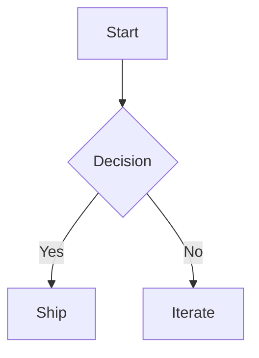
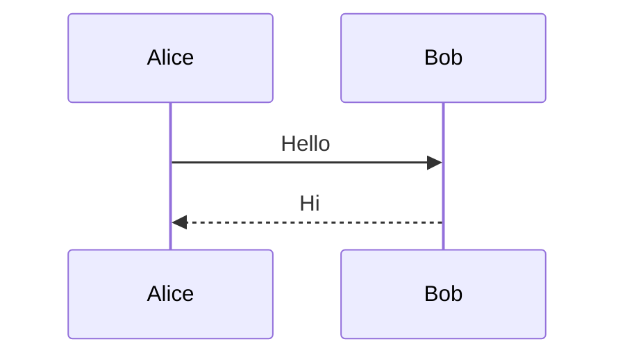

# Math & diagrams

astro-slides renders KaTeX math and PlantUML at build time (no runtime bytes) and Mermaid diagrams client-side as a lazily-hydrated island, all sharing the deck's click-stepping model.

## Math (KaTeX)

Math is written with dollar-delimited syntax and rendered at build time by KaTeX.

### Inline math

Wrap an expression in single `$...$`:

```mdx
The mass-energy relation is $E = mc^2$, familiar to everyone.
```

### Block (display) math

Wrap a block in double `$$...$$`:

```mdx
$$
\int_{-\infty}^{\infty} e^{-x^2}\,dx = \sqrt{\pi}
$$
```

### Why the `$` delimiters are mandatory (MDX gotcha)

Under MDX, `{` starts a JavaScript expression, so a raw `$e^{i\pi}$`
would fail to parse **before any plugin runs** ("Expecting Unicode escape
sequence \uXXXX"). astro-slides uses `remark-math`, whose tokenizer marks
`$…$` / `$$…$$` as math at parse time so the braces inside are treated as
math content, not JS. This means:

- Always keep math inside `$` / `$$` delimiters. Do not rely on other
  fences or raw LaTeX blocks — braces outside the delimiters will break the
  MDX parse.

### Stepped block math

A display-math block can reveal its rows across click steps. Put a step spec
in the block's info string (the meta after the opening `$$`), and separate
rows with `\\`:

```mdx
$$ {1|3|all}
a^2 + b^2 = c^2 \\
E = mc^2 \\
\nabla \cdot \mathbf{E} = \frac{\rho}{\varepsilon_0}
```

- The spec (e.g. `{1|3|all}`) drives which `\\`-separated rows appear at each
  click. Each row is tagged with `data-click` and revealed by the deck runtime.
- Stepped math steps are numbered **after** prose and code clicks on the slide
  — it shares the same authoritative click count, so a slide can mix stepped
  text, stepped code, and stepped math without collisions.
- Trade-off: in stepped mode each `\\` row renders independently, so `&`
  column alignment is **not** preserved across rows. Left-aligned stepped math
  is fine; use a non-stepped block if you need aligned columns.

### KaTeX CSS is conditional

KaTeX's stylesheet is only linked into a deck when that deck actually uses
math (`deck.features.katex`). Decks without any `$…$` pay zero CSS cost — you
don't need to configure anything; authoring math turns the styles on.

## Diagrams

### Mermaid (client-side, lazy)

Author a Mermaid diagram in a fenced code block tagged `mermaid`:

````mdx

````

- Mermaid fences are converted to a `<Mermaid>` component **before** code
  highlighting, so they are rendered as diagrams, not syntax-highlighted code.
- The Mermaid renderer is imported **only when a Mermaid diagram exists on the
  page** (Vite code-splits it), rendered to SVG, and mounted in a **Shadow
  DOM** so its injected CSS is isolated from the deck and vice versa.
- The diagram theme follows the deck's active color scheme and re-renders when
  the scheme changes. You can override it per-fence, and scale the diagram, via
  fence options:

````mdx

````

### PlantUML (build-time image)

Author PlantUML in a fence tagged `plantuml` (or `puml`):

````mdx
```plantuml
Alice -> Bob: Authentication Request
Bob --> Alice: Authentication Response
```
````

- At build time the source is encoded and turned into a server image URL,
  rendered as a plain `` — no client JS.
- Bare source is automatically wrapped in `@startuml` / `@enduml`, so you can
  omit those.
- The render server defaults to the public plantuml.com server and is
  configurable via the `plantumlServer` integration option.
- PlantUML color scheme is whatever the server renders — there is no automatic
  dark variant.

## Quick reference

| Feature | Syntax | Renders |
| --- | --- | --- |
| Inline math | `$...$` | Build-time KaTeX HTML |
| Block math | `$$ ... $$` | Build-time KaTeX HTML |
| Stepped math | `$$ {1\|3\|all}` + `\\` rows | Click-revealed rows |
| Mermaid | ` ```mermaid ` fence | Client SVG in Shadow DOM |
| PlantUML | ` ```plantuml ` / ` ```puml ` fence | Build-time server `` |
